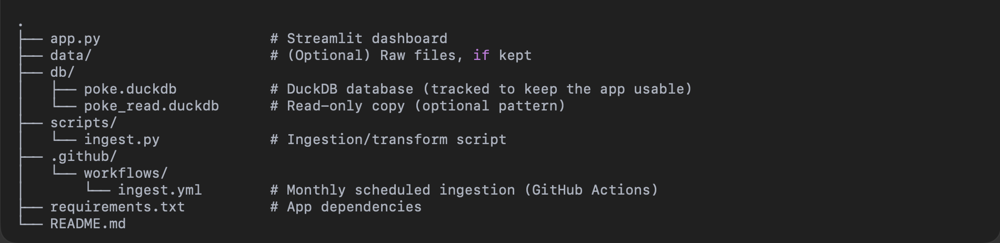

# VGC Pokémon Usage Stats Dashboard

An automated data engineering project that ingests competitive Pokémon VGC usage data, processes it into a queryable DuckDB database, and serves an interactive dashboard with Streamlit.

**Live App:** https://vgcpokemonstats.streamlit.app/
<p align="center">
  
</p>
<p align="center">
  
</p>

## Table of Contents

- [Why I Built This](#why-i-built-this)  
- [Project Overview](#project-overview)  
- [Skills Demonstrated](#skills-demonstrated)  
- [Repository Structure](#repository-structure)  
- [Architecture](#architecture)  
- [Data Model](#data-model)  
- [Dashboard Features](#dashboard-features)  
- [Automation with GitHub Actions](#automation-with-github-actions)  
- [How to Run Locally](#how-to-run-locally)  
- [Key Takeaways](#key-takeaways)  
- [Acknowledgments](#acknowledgments)


## Why I Built This

This project was designed as my first end-to-end **data engineering project**. I wanted to practice the core elements of the discipline:  

- **Extract–Transform–Load (ETL)** from an evolving, real-world data source.  
- **Schema design and data modeling** to make messy JSON usable.  
- **Workflow automation** with GitHub Actions for ongoing ingestion.  
- **Analytics and visualization** through SQL queries and dashboards.  
- **Deployment and reproducibility** so others can run and use the project.  

It also connects with something I enjoy — competitive Pokémon — making the work both practical and motivating.


## Project Overview

This project demonstrates end-to-end data engineering:

- **Data ingestion** — Python scripts pull official Smogon/Showdown usage stats.  
- **Storage** — Data is structured into a **DuckDB** database for analytics.  
- **Automation** — Monthly ingestion scheduled via **GitHub Actions** (CRON).  
- **Visualization** — Interactive **Streamlit** app to explore metagame trends.  

The pipeline updates automatically each month, keeping the data fresh and the dashboard current.


## Skills Demonstrated

- **ETL pipelines**: Extract → Transform → Load with Python + SQL  
- **Workflow automation**: Scheduled ingestion with GitHub Actions  
- **Data modeling**: Analytics-friendly schema in DuckDB  
- **SQL analytics**: Aggregations, filtering, joins  
- **Dashboarding**: Streamlit UI for exploration  


## Repository Structure
<p align="center">
  
</p>


## Architecture
<p align="center">
  
</p>


**Flow**

1. **Ingestion script (Python)** downloads Smogon VGC usage stats for a target month.  
2. **Transformations** parse, clean, and derive features (items, tera types, spreads, moves).  
3. Data is written to **DuckDB**.  
4. **GitHub Actions** (CRON) runs monthly to ingest the newest snapshot and commit the updated DB.  
5. **Streamlit** reads the DuckDB and Python file and renders the dashboard.


## Data Model

Main analytics table (example):

| Column                  | Type    | Description                                      |
|-------------------------|---------|--------------------------------------------------|
| `name`                  | VARCHAR | Pokémon name                                     |
| `usage`                 | DOUBLE  | Usage percentage                                 |
| `top_item`              | VARCHAR | Most common held item                            |
| `top_item_pct`          | DOUBLE  | % of sets with the item                          |
| `top_tera_type`         | VARCHAR | Most common Tera type                            |
| `top_tera_pct`          | DOUBLE  | % of sets with the Tera type                     |
| `top_spread`            | VARCHAR | Most common EV spread (e.g., `252/4/0/0/76/36`)  |
| `top_spread_no_nature`  | VARCHAR | Spread without nature (for display)              |
| `top_nature`            | VARCHAR | Most common nature                               |
| `move1..move4`          | VARCHAR | Top 4 moves                                      |
| `move1..move4_pct`      | DOUBLE  | % of sets using each move                        |
| `snapshot_month`        | VARCHAR | Snapshot month (YYYY-MM)                         |

This denormalized structure is optimized for read-heavy analytics and dashboard display.


## Dashboard Features

- **Top N Pokémon** by month (adjustable up to 100)  
- **Pokémon profile** (usage, top item + %, top tera + %, top spread + nature, top 4 moves with usage %)  
- **Meta distributions**:
  - Most common **items**  
  - Most common **tera types**  
  - Top **Pokémon** across all months  


## Automation with GitHub Actions

Monthly ingestion is scheduled via **`.github/workflows/ingest.yml`**:

- Runs on the **2nd of every month** (UTC).  
- Resolves the correct file for the latest regulation (e.g., `regi`, `regj`, `reghb03`, etc.) and **best-of-3 (bo3)** format.  
- Downloads and transforms the dataset.  
- Updates `db/poke.duckdb` and **commits changes back** to the repository.  

This keeps the dashboard up-to-date without manual intervention.


## How to Run Locally

### 1) Prerequisites

- Python 3.9+ (3.13 is fine)  
- `pip`  
- (Optional) `venv` or `uv`

### 2) Clone the repository

```bash
git clone https://github.com/luxyoga/vgcpokemonstats.git
cd vgcpokemonstats
```

### 3) Create a virtual environment and install dependencies

**macOS / Linux**
```bash
python -m venv .venv
source .venv/bin/activate
pip install -r requirements.txt
```
**Windows (PowerShell)**
```bash
python -m venv .venv
.venv\Scripts\Activate.ps1
pip install -r requirements.txt
```

### 4) (Optional) Ingest a specific month manually
```bash
python scripts/ingest.py --db db/poke.duckdb --month 2025-08
```

### 5) Launch the Streamlit app
```bash
streamlit run app.py
```

## Key Takeaways  

This project connects a personal interest—competitive Pokémon—with practical data engineering:  

- Built a real ETL pipeline with Python & SQL 
- Automated ingestion with GitHub Actions  
- Modeled and queried data efficiently in DuckDB  
- Delivered insights through a Streamlit dashboard  

It demonstrates the full lifecycle: **Ingest → Transform → Store → Analyze → Visualize**.  

## Acknowledgments  

- **Data source**: Smogon/Showdown usage stats  
- **Tools**: DuckDB, Streamlit, GitHub Actions  


