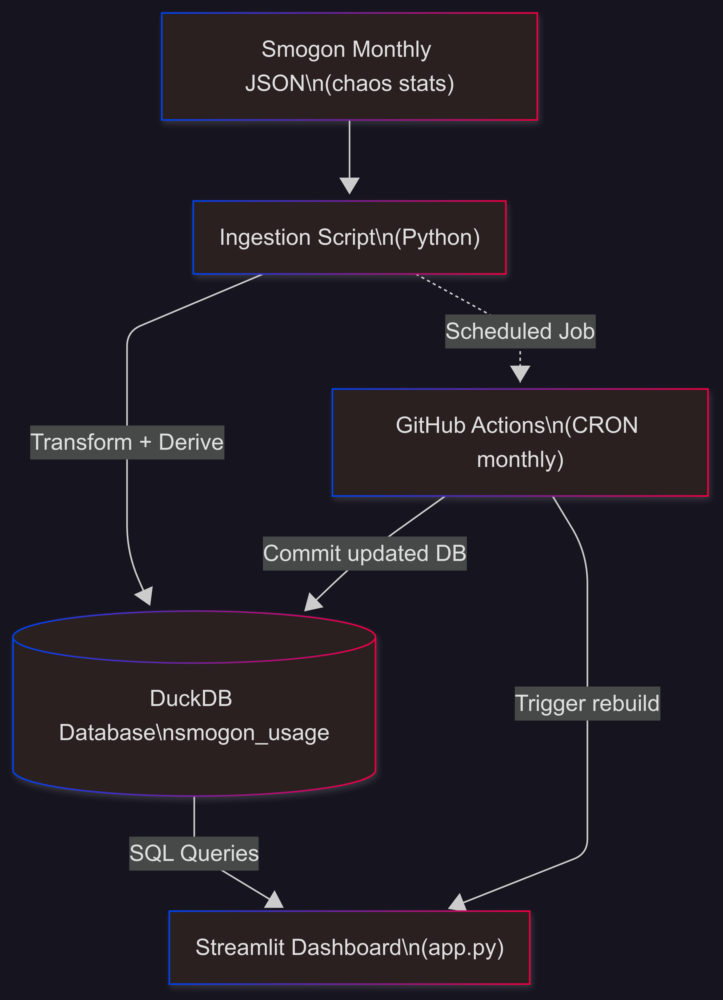

# Pokémon VGC Usage Stats — Automated Data Engineering Project

A fully automated **data pipeline + interactive dashboard** project that ingests competitive Pokémon VGC usage statistics from [Smogon](https://www.smogon.com/stats/), transforms the raw JSON into a structured **DuckDB** model, and publishes a live analytics dashboard using **Streamlit**.  

**Live app:** [https://vgcpokemonstats.streamlit.app/](https://vgcpokemonstats.streamlit.app/)  
**Repo:** [GitHub/luxyoga/vgcpokemonstats](https://github.com/luxyoga/vgcpokemonstats)

---

## Why I Built This

This project was designed as my first end-to-end **data engineering case study**. I wanted to practice the core elements of the discipline:  

- **Extract–Transform–Load (ETL)** from an evolving, real-world data source.  
- **Schema design and data modeling** to make messy JSON usable.  
- **Workflow automation** with GitHub Actions for ongoing ingestion.  
- **Analytics and visualization** through SQL queries and dashboards.  
- **Deployment and reproducibility** so others can run and use the project.  

It also connects with something I enjoy — competitive Pokémon — making the work both practical and motivating.

---

## Skills Demonstrated

- **Data ingestion & APIs:** Downloading structured JSON data directly from Smogon, handling changes in file naming (e.g., monthly regulation shifts).  
- **Data transformation:** Flattening nested JSON into tabular form, computing derived attributes (top item, top moves, spreads, tera type).  
- **Data modeling:** Designing a fact-style table `smogon_usage` with clear columns for usage %, items, tera types, natures, spreads, and moves.  
- **SQL & DuckDB:** Leveraging SQL for aggregation, filtering, and analytics in a portable, serverless OLAP database.  
- **Automation & orchestration:** GitHub Actions scheduled workflow to run ingestion on the 3rd of every month, ensuring fresh data.  
- **Reproducibility:** Database versioned in Git for small size, requirements tracked in `requirements.txt`.  
- **Visualization & reporting:** Interactive dashboard in Streamlit with meta distribution charts, top-N tables, Pokémon profiles, and “all-time” aggregation.  
- **Engineering mindset:** Built for idempotency (safe re-runs), scalability (can ingest any range of months), and resilience (handles missing/late files).  

---

## Architecture

  

